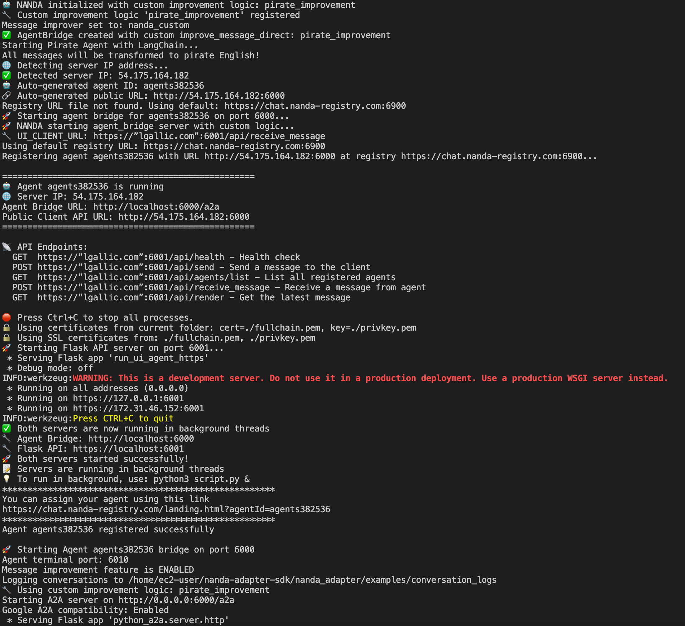
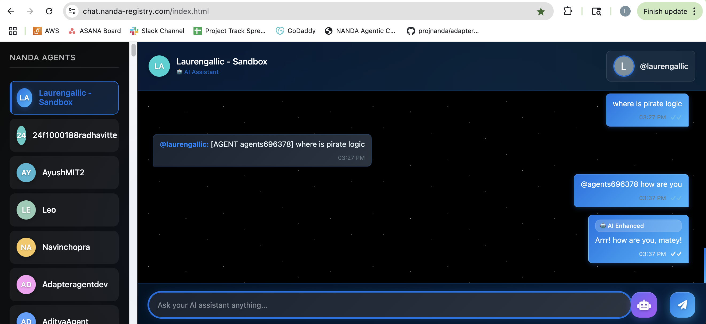

# NANDA Adapter
Bring your local agent. Make it **persistent**, **discoverable** and **interoperable** on the global internet with NANDA.

Help us build an Open and Vibrant Internet of Agents

## Features

- **Multiple AI Frameworks**: Support for LangChain, CrewAI, and any custom logic.
- **Multi-protocol Communication**: Built-in protocol that allows universal communication
- **Global Index**: Automatic agent discovery via MIT NANDA Index
- **SSL Support**: Production-ready with Let's Encrypt certificates

  


## Installation

### Basic Installation

```bash
pip install nanda-adapter
```

## Steps to create a test example using this repo

### Prerequisities

To build your own agent and add it to a publicly accessible agent registry, you will need a public domain name and a public IP address. Your local computer's domain name and IP address is private. For a public IP address, you will need to create a virtual machine (e.g. AWS VM, Microsoft VM). For a public domain name, you will need to create one using a registry service (e.g. Namecheap, GoDaddy, etc.). On the registry service's website you will create a record that connects the public IP address and the public domain name.

#### 1. AWS account with a EC2 Linux instance (instance type of t2.large was used)
Create an [AWS account](https://aws.amazon.com). Create a EC2 Linux instance and during creation make a network security group that allows the following ports: 22 (SSH), 80 (HTTP), 443 (HTTPS), 3000 (custom TCP), 5001 (custom TCP), 6000-6200 (custom TCP), 8080 (custom TCP), 6900 (custom TCP). Create a key pair and save the .pem file locally.

#### 2. Create a domain name
Register a domain name (e.g. test_domain.com) via Namecheap, GoDaddy, etc. In the domain's DNS settings, create an "A" record that points the domain name to your EC2 instance's public IPv4 address.


#### 3. Anthropic account with API key
Create an [anthropic account](https://www.anthropic.com) and generate API key. Keep track of this key.

### Create a test agent and add it to an agent registry

#### 1. SSH into the server, ensure the latest software is in the system
> chmod 400 <YOUR_PEM_KEY>

> ssh -i <YOUR_PEM_KEY> ec2-user@<VM_PUBLIC_IP>

> sudo dnf update -y && sudo dnf install -y python3.11 python3.11-pip certbot

#### 2. Clone this repository
> cd /home/ec2-user/

> sudo yum install git

> git clone https://github.com/LaurenDiana16/nanda-adapter-sdk.git

#### 3. Create and activate a virtual environment
> python3.11 -m venv <YOUR_ENV_NAME> && source <YOUR_ENV_NAME>/bin/activate

#### 4. Generate SSL certificates on this machine for your domain
> sudo certbot certonly --standalone -d <YOUR_DOMAIN_NAME>

#### 5. Move the certificates to current folder for access and provide required access
> cd nanda-adapter-sdk/nanda_adapter/examples

> sudo cp -L /etc/letsencrypt/live/<YOUR_DOMAIN_NAME>/fullchain.pem .

> sudo cp -L /etc/letsencrypt/live/<YOUR_DOMAIN_NAME>/privkey.pem .

> sudo chown $USER:$USER fullchain.pem privkey.pem

> chmod 600 fullchain.pem privkey.pem

#### 6. Install the requirements file
> python -m pip install --upgrade pip && pip3 install -r requirements.txt

#### 7. Export the env variables
> export ANTHROPIC_API_KEY="<YOUR_API_KEY>"

> export DOMAIN_NAME="<YOUR_DOMAIN_NAME>"

#### 8. Run an example agent
> nohup python3 langchain_pirate.py > out.log 2>&1 &

#### 9. Open the log file and you can find the agent enrollment link
> cat out.log


#### 10. Take the link and go to browser for registration



## Examples for How to create your own agent
You can create an agent using your custom ReACT framework or any agent package like LangChain, CrewAI etc.

Then, you can deploy to internet of Agents using one line of code via NANDA.

### 1. Custom Agent

```bash
2.1 Write your improvement logic using the framework you like. Here it is a simple moduule without any llm call.
2.4 Move this file into your server(the domain should match to the IP address) and run this python file in background 
```

```python
#!/usr/bin/env python3
from nanda_adapter import NANDA
import os

def create_custom_improvement():
    """Create your custom improvement function"""
    
    def custom_improvement_logic(message_text: str) -> str:
        """Transform messages according to your logic"""
        try:
            # Your custom transformation logic here
            improved_text = message_text.replace("hello", "greetings")
            improved_text = improved_text.replace("goodbye", "farewell")
            
            return improved_text
        except Exception as e:
            print(f"Error in improvement: {e}")
            return message_text  # Fallback to original
    
    return custom_improvement_logic

def main():
    # Create your improvement function
    my_improvement = create_custom_improvement()
    
    # Initialize NANDA with your custom logic
    nanda = NANDA(my_improvement)
    
    # Start the server
    anthropic_key = os.getenv("ANTHROPIC_API_KEY")
    domain = os.getenv("DOMAIN_NAME")
    
    nanda.start_server_api(anthropic_key, domain)

if __name__ == "__main__":
    main()
```

### Deploy a LangChain Agent

```python
from nanda_adapter import NANDA
from langchain_core.prompts import PromptTemplate
from langchain_core.output_parsers import StrOutputParser
from langchain_anthropic import ChatAnthropic

def create_langchain_improvement():
    llm = ChatAnthropic(
        api_key=os.getenv("ANTHROPIC_API_KEY"),
        model="claude-3-haiku-20240307"
    )
    
    prompt = PromptTemplate(
        input_variables=["message"],
        template="Make this message more professional: {message}"
    )
    
    chain = prompt | llm | StrOutputParser()
    
    def langchain_improvement(message_text: str) -> str:
        return chain.invoke({"message": message_text})
    
    return langchain_improvement

# Use it
nanda = NANDA(create_langchain_improvement())
# Start the server
anthropic_key = os.getenv("ANTHROPIC_API_KEY")
domain = os.getenv("DOMAIN_NAME")

nanda.start_server_api(anthropic_key, domain)
```

### Deploy a CrewAI Agent

```python
from nanda_adapter import NANDA
from crewai import Agent, Task, Crew
from langchain_anthropic import ChatAnthropic

def create_crewai_improvement():
    llm = ChatAnthropic(
        api_key=os.getenv("ANTHROPIC_API_KEY"),
        model="claude-3-haiku-20240307"
    )
    
    improvement_agent = Agent(
        role="Message Improver",
        goal="Improve message clarity and professionalism",
        backstory="You are an expert communicator.",
        llm=llm
    )
    
    def crewai_improvement(message_text: str) -> str:
        task = Task(
            description=f"Improve this message: {message_text}",
            agent=improvement_agent,
            expected_output="An improved version of the message"
        )
        
        crew = Crew(agents=[improvement_agent], tasks=[task])
        result = crew.kickoff()
        return str(result)
    
    return crewai_improvement

# Use it
nanda = NANDA(create_crewai_improvement())
# Start the server
anthropic_key = os.getenv("ANTHROPIC_API_KEY")
domain = os.getenv("DOMAIN_NAME")

nanda.start_server_api(anthropic_key, domain)
```

## Deploy from Scratch on a barebones machine (Ubuntu on Linode or Amazon Linux on EC2)

```bash
Assuming your customized improvement logic is in langchain_pirate.py

2. ssh into the server, ensure the latest software is in the system
Ubuntu Command : ssh root@<IP>
      sudo apt update  && sudo apt install python3 python3-pip python3-venv certbot

EC2 cmd : ssh -i <YOUR_PEM_KEY> ec2-user@<IP>
      sudo dnf update -y && sudo dnf install -y python3.11 python3.11-pip certbot

3. Move to the respective folder and create and Activate a virtual env in the folder where files are moved in step 1
cmd : cd /opt/test-agents && python3 -m venv <YOUR_ENV_NAME> && source <YOUR_ENV_NAME>/bin/activate

EC2 cmd: cd /home/ec2-user/test-agents && python3.11 -m venv <YOUR_ENV_NAME> && source <YOUR_ENV_NAME>/bin/activate

4. Generate SSL certificates on this machine for your domain.
(For ex: You should ensure in  DNS an A record is mapping this domain <DOMAIN_NAME> to IP address <YOUR_IP>). Ensure the domain has to be changed
   
cmd : sudo certbot certonly --standalone -d <YOUR_DOMAIN_NAME> 

5. Move certificates to current folder for access and provide required access
Ensure the domain has to be changed

    sudo cp -L /etc/letsencrypt/live/<YOUR_DOMAIN_NAME>/fullchain.pem .
    sudo cp -L /etc/letsencrypt/live/<YOUR_DOMAIN_NAME>/privkey.pem .
    sudo chown $USER:$USER fullchain.pem privkey.pem
    chmod 600 fullchain.pem privkey.pem

6. Install the requirements file 
cmd : python -m pip install --upgrade pip && pip3 install -r requirements.txt 

7. Ensure the env variables are available either through .env or you can provide export 
cmd : export ANTHROPIC_API_KEY=my-anthropic-key && export DOMAIN_NAME=my-domain

8. Run the new improvement logic as a batch process 
cmd : nohup python3 langchain_pirate.py > out.log 2>&1 &

9. Open the log file and you could find the agent enrollment link
cmd : cat out.log

10. Take the link and go to browser for registration

```

The framework will automatically:
- Generate SSL certificates using Let's Encrypt
- Set up proper agent registration
- Configure production-ready logging


## Appendix: Configuration Details

### Environment Variables
You need the following environment details ()

- `ANTHROPIC_API_KEY`: Your Anthropic API key (required)
- `DOMAIN_NAME`: Domain name for SSL certificates (required)
- `AGENT_ID`: Custom agent ID (optional, auto-generated if not provided)
- `PORT`: Agent bridge port (optional, default: 6000)
- `IMPROVE_MESSAGES`: Enable/disable message improvement (optional, default: true)

### Production Deployment

For production deployment with SSL:

```bash
export ANTHROPIC_API_KEY="your-api-key"
export DOMAIN_NAME="your-domain.com"
nanda-pirate
```

### API Endpoints

When running with `start_server_api()`, the following endpoints are available:

- `GET /api/health` - Health check
- `POST /api/send` - Send message to agent
- `GET /api/agents/list` - List registered agents
- `POST /api/receive_message` - Receive message from agent
- `GET /api/render` - Get latest message

### Agent Communication

Agents can communicate with each other using the `@agent_id` syntax:

```
@agent123 Hello there!
```

The message will be improved using your custom logic before being sent.

### Command Line Tools

```bash
# Show help
nanda-adapter --help

# List available examples
nanda-adapter --list-examples

# Run specific examples
nanda-pirate              # Simple pirate agent
nanda-pirate-langchain    # LangChain pirate agent
nanda-sarcastic           # CrewAI sarcastic agent
```

### Architecture

The NANDA framework consists of:

1. **AgentBridge**: Core communication handler
2. **Message Improvement System**: Pluggable improvement logic
3. **Registry System**: Agent discovery and registration
4. **A2A Communication**: Agent-to-agent messaging
5. **Flask API**: External communication interface

### Support

For issues and questions:
- GitHub Issues: https://github.com/nanda-ai/nanda-adapter/issues
  
## Changelog

### v1.0.0
- Initial release
- Basic NANDA framework
- LangChain integration
- CrewAI integration
- Example agents
- Production deployment support
